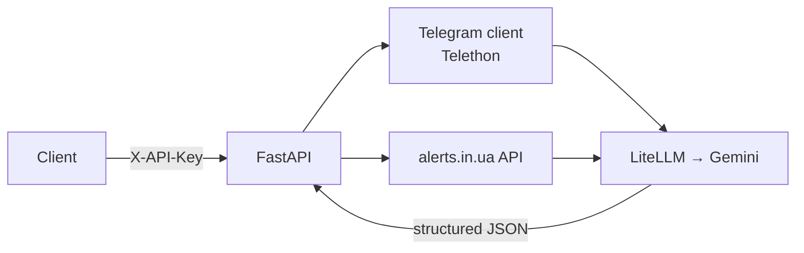

# Aniks API

An async FastAPI service that combines live data sources with LLM analysis.
It reads Telegram channels and the [alerts.in.ua](https://alerts.in.ua) API to produce a structured air-raid danger assessment for Kyiv, summarises long group chats into decisions and action items, and exposes a few smaller LLM utilities.

> **Disclaimer:** the air-raid analysis is an experimental LLM summary of public Telegram channels. It is **not** a safety tool and must never replace official air-raid alerts.

## Features

- **Air-raid danger analysis** ([details](#air-raid-danger-analysis)). Gathers recent messages from monitoring channels, filters them by keywords, merges them with the official alert status and asks the LLM for a structured `green` / `yellow` / `red` assessment.
- **Chat digest.** Reads the latest messages of a configured Telegram chat and reports only the decisions made and actions required.
- **Official alert status.** A thin wrapper around the alerts.in.ua API for Kyiv city and oblast.
- **LLM utilities.** Recipe suggestions from a list of ingredients and a joke generator.
- **Production basics.** API-key auth, per-IP rate limiting, response caching, typed settings and Docker.

## Tech stack

| Area | Tools |
|---|---|
| API | FastAPI, Pydantic v2, pydantic-settings |
| LLM | LiteLLM (Gemini models), structured outputs |
| Data sources | Telethon (Telegram MTProto), httpx (alerts.in.ua) |
| Infra | slowapi, cachetools, Docker / Docker Compose |

## Architecture



```
core/
├── main.py              # app factory, lifespan, routers, middleware
├── settings.py          # typed settings loaded from .env
├── services.py          # API-key auth, client IP, speed test
├── alert/               # alerts.in.ua integration
├── llm/                 # prompts, LLM services and routes
└── telegram_client/     # Telethon client and message gathering
```

Each feature module follows the same layout: `routes.py` (HTTP layer), `services.py` (business logic), `models.py` (Pydantic schemas).

## Getting started

### Prerequisites

- Python 3.11+
- A [Gemini API key](https://aistudio.google.com/apikey)
- Telegram `api_id` / `api_hash` from [my.telegram.org](https://my.telegram.org/apps)
- An [alerts.in.ua](https://alerts.in.ua/api-request) API token (optional)

### Configuration

```bash
cp env.example .env
```

Fill in `.env`. The main variables are:

| Variable | Required | Description |
|---|---|---|
| `API_KEYS` | yes | JSON list of keys accepted in the `X-API-Key` header |
| `GEMINI_API_KEY` | yes | Gemini key used by LiteLLM |
| `AP_ID`, `API_HASH` | yes | Telegram application credentials |
| `SESSION_STRING` | yes | Telethon string session (see below) |
| `ALERTS_TOKEN` | no | alerts.in.ua token |
| `CHAT_DIGEST_CHAT_NAME_PREFIX` | no | Beginning of the chat name to summarise |
| `CHAT_DIGEST_TOPICS` | no | Topics the digest should focus on |
| `CHAT_DIGEST_EXTRA_INSTRUCTIONS` | no | Extra instructions for the digest prompt |
| `LOCAL_DEV` | no | `true` enables Swagger docs and adds a `test_key` API key |
| `FORWARDED_ALLOW_IPS` | no | Reverse-proxy IPs trusted to set `X-Forwarded-For` (see [Deployment notes](#deployment-notes)) |

To generate a `SESSION_STRING`, run this once and log in with your phone number:

```bash
python -c "from telethon.sync import TelegramClient; from telethon.sessions import StringSession; \
c = TelegramClient(StringSession(), int(input('api_id: ')), input('api_hash: ')); c.start(); print(c.session.save())"
```

### Run locally

```bash
python3 -m venv venv
source venv/bin/activate
pip install -r requirements.txt
uvicorn core.main:app --reload
```

### Run with Docker

```bash
docker compose up --build
```

The API is served at `http://localhost:8000`.

## API

Base path: `/api/v1`. All endpoints except `/alerts/kyiv` require an `X-API-Key` header.

| Method | Endpoint | Description |
|---|---|---|
| GET | `/llms/danger-kyiv` | Structured air-raid danger assessment for Kyiv (cached for 60 s) |
| GET | `/llms/chat-interest` | Decisions and action items from the configured chat (cached for 60 s) |
| POST | `/llms/recipe` | Recipe from a JSON list of ingredients |
| POST | `/llms/joke` | A short LLM-generated joke |
| GET | `/llms/all` | Supported LLM models |
| GET | `/air_tg/all` | Filtered messages from the monitoring Telegram channels |
| GET | `/alerts/kyiv` | Official alert status for Kyiv city and oblast |
| GET | `/hello/` | Health check |
| GET | `/speedtest/` | Server download/upload speed and ping |

When `LOCAL_DEV=true`, interactive Swagger docs are available at `/api/v1/docs`. Use the **Authorize** button to set your API key. Docs are disabled in production.

## Air-raid danger analysis

> ⚠️ **This is not a safety tool.** The output is an LLM interpretation of unofficial Telegram channels and may be late, incomplete or wrong. Always follow official air-raid alerts and the guidance of local authorities.

`GET /api/v1/llms/danger-kyiv` works in four steps:

1. **Collect.** Fetches the latest messages from several public air-monitoring Telegram channels.
2. **Filter.** Keeps only messages that contain threat-related keywords (UAVs, missiles, all-clear, etc.) and splits them into the last 5 minutes and recent history.
3. **Enrich.** Adds the official Kyiv city and oblast alert status from alerts.in.ua. If one of the two sources is unavailable, the analysis continues with the other one. If both are unavailable, the endpoint returns `503`.
4. **Analyse.** Sends the data to the LLM with a JSON schema and validates the response against a Pydantic model. Invalid model output returns `502` instead of being passed to the client.

The result is cached for 60 seconds to limit LLM cost and rate-limit pressure.

```bash
curl -H "X-API-Key: <your-key>" http://localhost:8000/api/v1/llms/danger-kyiv
```

```json
{
  "danger": "yellow",
  "details": "UAVs reported moving towards Kyiv oblast by @kpszsu ..."
}
```

`danger` is one of `green`, `yellow` or `red`.

## Deployment notes

Rate limiting is per client IP. If the API runs behind a reverse proxy (nginx, Traefik, Cloudflare Tunnel), set `FORWARDED_ALLOW_IPS` to the proxy's IP or subnet. Uvicorn will then read the real client IP from `X-Forwarded-For`. Headers from any other source are ignored, so clients can't spoof their IP to bypass rate limits.
